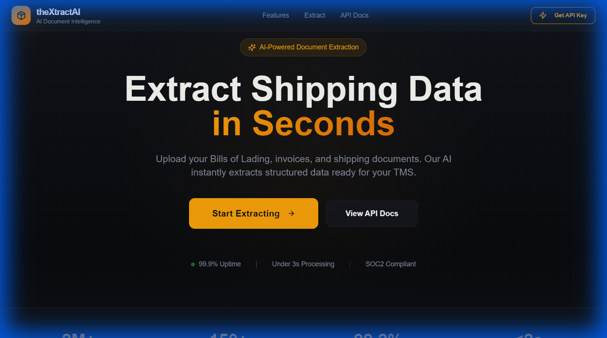

# theXtractAI - Intelligent Document Processing



**theXtractAI** is a modern logistics document intelligence platform that uses AWS Textract to instantly extract structured data from Bills of Lading (BoL), invoices, and other shipping documents. It features a React-based frontend for easy drag-and-drop testing and a robust FastAPI backend for seamless API integration.

## Features

-   **Smart OCR**: Powered by AWS Textract to handle complex forms and tables.
-   **Structured Data**: Returns clean JSON with key fields like Shipper, Consignee, Origin, and Destination.
-   **Full Extraction**: Captures all available key-value pairs from the document.
-   **Developer Friendly**: Simple REST API with auto-generated docs (`/docs`).
-   **Modern UI**: Built with React, Vite, and ShadCDN for a premium user experience.

## Quick Start

### Prerequisites
-   Python 3.12+
-   Node.js 20+
-   AWS Token/Credentials with Textract access

### Setup

1.  **Clone the repository** and navigate to the root directory.

2.  **Install Backend Dependencies**:
    ```bash
    python -m venv venv
    .\venv\Scripts\activate  # Windows
    source venv/bin/activate # Linux/Mac
    pip install -r requirements.txt
    ```

3.  **Configure Environment**:
    Create a `.env` file in the root with your AWS credentials:
    ```env
    AWS_ACCESS_KEY_ID=your_key
    AWS_SECRET_ACCESS_KEY=your_secret
    AWS_REGION=us-east-1
    ```

4.  **Build Frontend** (Optional, if modifying UI):
    ```bash
    cd textract-spark
    npm install
    npm run build
    cd ..
    ```

5.  **Run the Application**:
    ```bash
    python main.py
    ```

6.  **Access the App**:
    -   Frontend: [http://localhost:8000](http://localhost:8000)
    -   API Docs: [http://localhost:8000/docs](http://localhost:8000/docs)

## API Usage

### Extract Bill of Lading

**Endpoint**: `POST /extract/bol`

**Example**:
```python
import requests

url = "http://localhost:8000/extract/bol"
files = {"file": open("my_bol.pdf", "rb")}
response = requests.post(url, files=files)

print(response.json())
```
